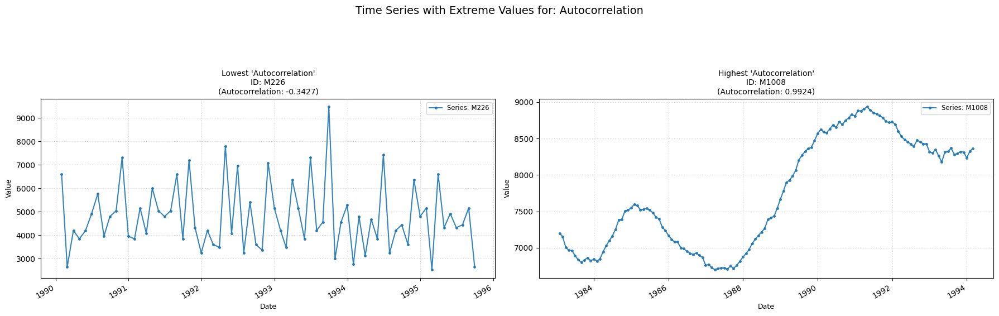
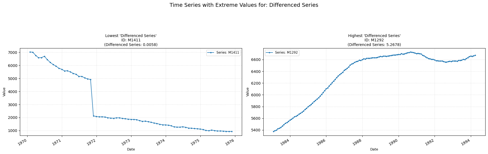

## ac

Computes the autocorrelation of the time-series.

**Low value:** Means the linear relationship between current and past values in the series is very low.  
**High value:** Means the linear relationship between current and past values in the sries is very high, and usually indicates one or more trends.

    

    

**No parameters**

## diff_series

Computes the autocorrelation value of the differenced series.

**Low value:** Means there is no linear relationship between past and current values in the de-trended series.  
**High value:** Means there is a significant linear relationship between past and current values in the de-trended series.

    

    

**No parameters**

