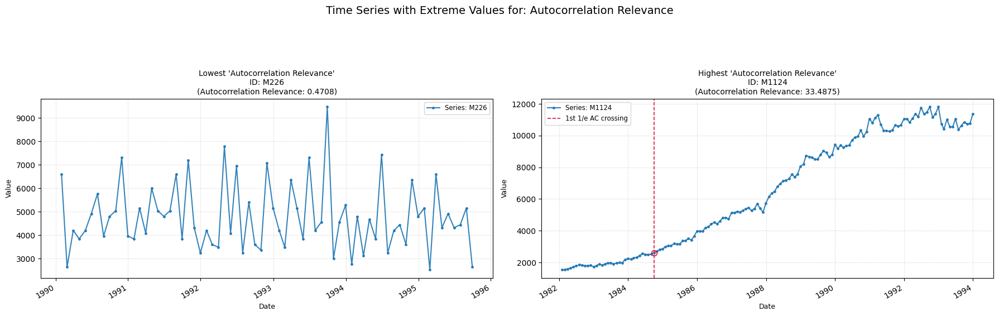

## **ac_relevance**

Measures the first time lag at which the autocorrelation function drops below 1/e.

**Low value:** Means the series has a more unpredicatble behaviour.  
**High value:** Means the series has a more predictable behaviour.

    

    

##### **No Parameters**

##### **Calculation**

1.	**Autocovariance Function (ACVF):** The autocovariance function of the time series Yt is computed for various lags k.

2.	**First 1/e-Crossing:** The feature value is computed and returned as the smallest positive for which ACVF(k) crosses the defined 1/e threshold. 

##### **Practical Usefulness Examples**

**Speech Processing:** In analyzing a speech signal, the first zero-crossing of the autocovariance can be related to the fundamental frequency (pitch) of voiced segments, helping in speech recognition or speaker identification.

**Climate Science:** For temperature data, this feature might indicate the dominant short-term cyclical component (related to diurnal cycles if data is high frequency, for example).

