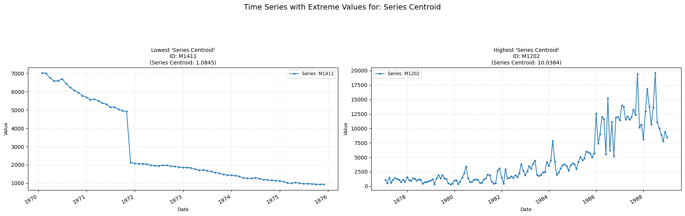

## **centroid**

Computes the centroid along the time axis.

**Low value:** Means the primary/patterns fluctuations of the series occur slowly.  
**High value:** Means the primary patterns/fluctuations of the series occur rapidly, with fast and short-term changes.

    

    

<table id="T_891f1">
  <thead>
    <tr>
      <th id="T_891f1_level0_col0" class="col_heading level0 col0" >Parameter</th>
      <th id="T_891f1_level0_col1" class="col_heading level0 col1" >Type</th>
      <th id="T_891f1_level0_col2" class="col_heading level0 col2" >Default</th>
      <th id="T_891f1_level0_col3" class="col_heading level0 col3" >Description</th>
    </tr>
  </thead>
  <tbody>
    <tr>
      <td id="T_891f1_row0_col0" class="data row0 col0" >fs</td>
      <td id="T_891f1_row0_col1" class="data row0 col1" >int</td>
      <td id="T_891f1_row0_col2" class="data row0 col2" >Mandatory</td>
      <td id="T_891f1_row0_col3" class="data row0 col3" >Sampling frequency</td>
    </tr>
  </tbody>
</table>

##### **Calculation**

1.	**Power Spectral Density (PSD):** The PSD of the time series is computed, which shows the power of the signal at each frequency f.
 
2.	**Centroid Calculation:** The spectral centroid C, which is returned, is computed as the power-weighted average of the frequencies. The sum is over all frequency bins k.

##### **Practical Usefulness Examples**

**Audio Analysis:** In music information retrieval, the spectral centroid distinguishes between "bright" sounds (high centroid, like cymbals) and "dull" sounds (low centroid, like a bass drum), aiding in instrument recognition or genre classification.

**Vibration Analysis:** For machine diagnostics, a shift in the spectral centroid of vibration signals can indicate changes in operational speed or the emergence of specific fault frequencies (bearing defects often have characteristic high-frequency components, for example).
