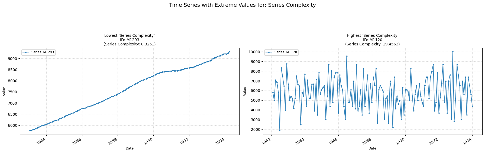

## **complexity**

Computes the complexity estimate of the z-normalized time series.

**Low value:** A low/null value means the series is relatively constant over time, with no big changes.  
**High value:** A high value means the series has a high complexity, with several big changes.

    

    

##### **No Parameters**

##### **Calculation**

1.	**Z-Normalization:** First, the series is z-normalized.

2.	**Raw Complexity Estimate:** Then, if the length of Z is less than 2, the returned value for complexity is 0. Otherwise, the complexity of the series is computed in the following fashion:
    - The first differences of the normalized series are computed.
    - The complexity estimate is computed and returned as the square root of the sum of the squares of these differences.

##### **Practical Usefulness Examples**

**Signal Processing:** When comparing different sensor readings that measure the same phenomenon, a much higher complexity in one signal might indicate noise or interference, rather than true signal variation.

**Machine Condition Monitoring:** An increase in the complexity of vibration data from a machine over time could indicate developing faults or wear and tear, as the vibrations become less regular.
