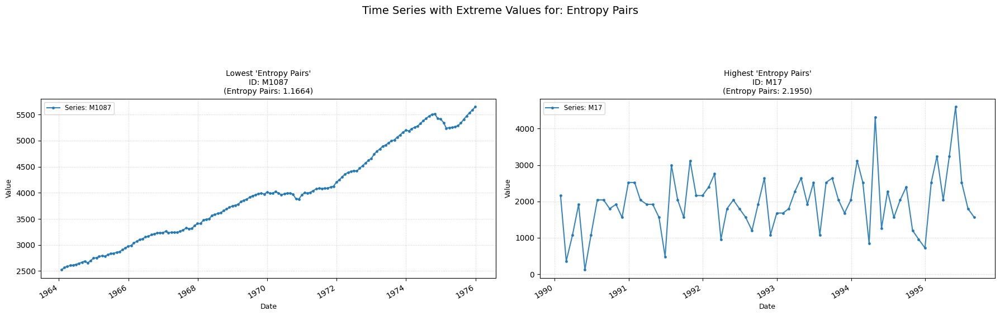

## **entropy_pairs**

Measures entropy based on the 3 quantile bins of the time-series.  
**Low value:** Means simpler patterns in the time-series sequence.  
**High value:** Means more complex patterns in the time-series sequence.

    

    

##### **No Parameters**

##### **Calculation**

1.	**Symbolization (Coarse Graining):** The continuous time series is converted into a discrete symbolic series yt of the same length, which is achieved using a "quantile" based method with an alphabet size of 3. Data points are mapped to symbols {1, 2, 3} based on whether they fall into the lower, middle, or upper third of the data's value distribution.

2.	**Occurrences of Single Symbols Counting:** For each symbol s in the alphabet {1, 2, 3}, the indices of all its occurrences in the symbolized series yt are found and their counts are stored.

3.	**Frequencies of Symbol Pairs (Transitions) Calculation:** For every possible pair of symbols (i, j) where i is the current symbol and j is the next symbol (both from {1, 2, 3}), the number of times the sequence "symbol i followed immediately by symbol j" appears in yt is counted, and then the normalized frequency for this pair is computed. 

4.	**Conditional Entropies Calculation:** For each current symbol i (from 1 to 3), the Shannon entropy of the distribution of the next symbols is computed.

5.	**Final Sum Calculation:** The final value that is computed and returned is the sum of these conditional entropies.

##### **Practical Usefulness Examples**

**Medical Diagnostics:** Analyzing physiological signals (like EEG), specific motif distributions captured by this entropy might differentiate between healthy and pathological states, even if overall signal amplitude or frequency is similar.

**Anomaly Detection in Sensor Networks:** A sudden change in the feature value from the data of a sensor reading could indicate a novel system behavior or a sensor malfunction, suggesting a deviation from its typical complex pattern generation.

