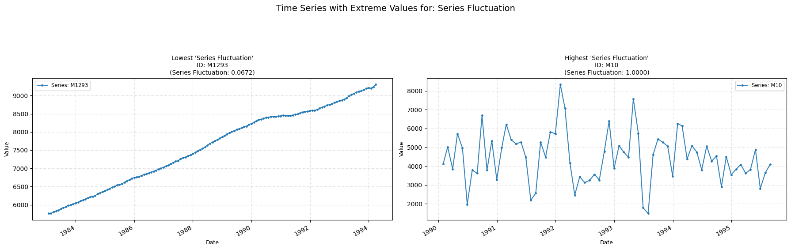

## **fluctuation**

Measures the proportion of large changes in the time-series.  
**Low value:** Means few/none large fluctuations.  
**High value:** Means many large fluctuations.

    

    

##### **No Parameters**

##### **Calculation**

1.	**Z-Normalization:** First, the time series Yt is z-normalized.

2.	**Successive Differences:** Then the absolute differences between consecutive values of the z-normalized series are calculated.

3.	**Thresholding and Counting:** The counting of the number of absolute differences that are greater than a defined threshold (0.04) is computed.

4.	**Proportion:** The final value, which is returned, is the proportion of such differences.

##### **Practical Usefulness Examples**

**Financial Market Volatility:** In analyzing stock price differences, a high value might indicate a "jumpy" market with frequent large price changes over short intervals, signaling higher risk or specific trading conditions.

**Wearable Health Monitoring:** For activity data from a wearable, a higher value could distinguish between smooth, consistent activity and erratic, stop-and-go movements.

