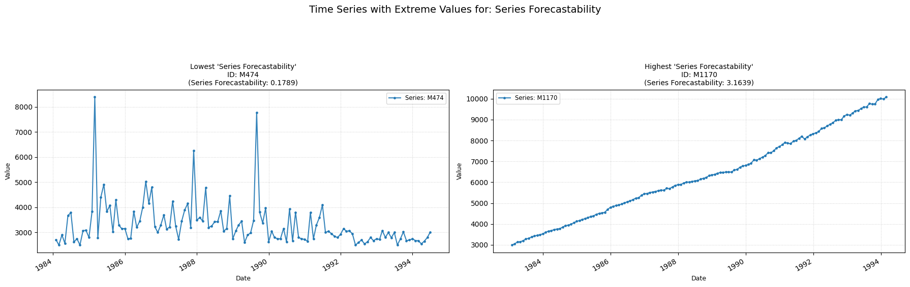

## **forecastability**

Measures the forecastibility of a time-series.  
**Low value:** Means there are strong signs of a trend across the time-series.  
**High value:** Means the time-series is probably white-noise.

    

    

##### **Parameters Table**

<table id="T_02295">
  <thead>
    <tr>
      <th id="T_02295_level0_col0" class="col_heading level0 col0" >Parameter</th>
      <th id="T_02295_level0_col1" class="col_heading level0 col1" >Type</th>
      <th id="T_02295_level0_col2" class="col_heading level0 col2" >Default</th>
      <th id="T_02295_level0_col3" class="col_heading level0 col3" >Description</th>
    </tr>
  </thead>
  <tbody>
    <tr>
      <td id="T_02295_row0_col0" class="data row0 col0" >sf</td>
      <td id="T_02295_row0_col1" class="data row0 col1" >float</td>
      <td id="T_02295_row0_col2" class="data row0 col2" >Mandatory</td>
      <td id="T_02295_row0_col3" class="data row0 col3" >Sampling frequency.</td>
    </tr>
    <tr>
      <td id="T_02295_row1_col0" class="data row1 col0" >method</td>
      <td id="T_02295_row1_col1" class="data row1 col1" >str</td>
      <td id="T_02295_row1_col2" class="data row1 col2" >'welch'</td>
      <td id="T_02295_row1_col3" class="data row1 col3" >PSD calculation method ('welch' or 'fft').</td>
    </tr>
    <tr>
      <td id="T_02295_row2_col0" class="data row2 col0" >nperseg</td>
      <td id="T_02295_row2_col1" class="data row2 col1" >int or None</td>
      <td id="T_02295_row2_col2" class="data row2 col2" >None</td>
      <td id="T_02295_row2_col3" class="data row2 col3" >Segment length for welch method. If None, default based on data length</td>
    </tr>
    <tr>
      <td id="T_02295_row3_col0" class="data row3 col0" >normalize</td>
      <td id="T_02295_row3_col1" class="data row3 col1" >bool</td>
      <td id="T_02295_row3_col2" class="data row3 col2" >False</td>
      <td id="T_02295_row3_col3" class="data row3 col3" >Normalize output to [0, 1]</td>
    </tr>
  </tbody>
</table>

##### **Calculation**

1.	**Power Spectral Density (PSD):** The PSD of the time series is computed. This is done using the user chosen model. The Welch's method (the default model) uses these formula:
o	The series is divided into (potentially overlapping) segments.
o	Each segment is windowed (with a Hann window).
o	The Fast Fourier Transform (FFT) is computed for each windowed segment.
o	The squared magnitude of the FFT gives the periodogram for that segment.
o	The PSD is calculated as the average of these periodograms.

2.	**Normalization:** The PSD is normalized so that it sums to 1, effectively treating it as a probability distribution of power across frequencies.

3.	**Shannon Entropy:** Then the Shannon entropy of this normalized PSD is calculated.

4.	**Forecastability Value:** The computed entropy value is inverted (1/H) and returned.

##### **Practical Usefulness Examples**

**Inventory Management:** For a product with high sales forecastability, a business can maintain lower safety stock. For a product with low forecastability (highly random sales), higher safety stock might be needed to avoid stockouts.

**Call Center Staffing:** If call arrival rates have high forecastability, staffing levels can be optimized more precisely. Low forecastability might require more flexible staffing or overstaffing to handle unpredictable peaks.
