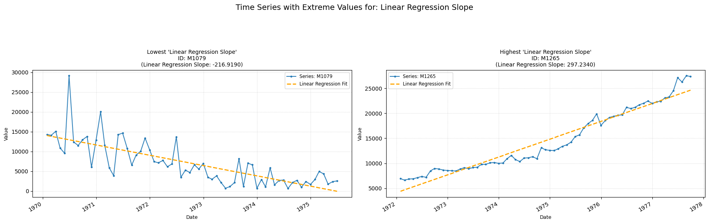
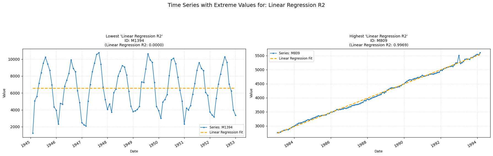

## **linear_regression_slope**

Measures the overall linear trend slope.  
**Low value:** A negative value means there is a downward trend.  
**High value:** A positive value means an upward trend.

    

    

##### **No Parameters**

##### **Calculation**

1.  **Linear Regression Fitting:** First, the linear regression model yi=β0+β1xi is fitted, yielding predicted values yi.

2.  **Ordinary Least Squares (OLS):** Then, the returned value (slope β1) is estimated by minimizing the sum of squared residuals.

##### **Practical Usefulness Examples**

**Resource Depletion:** While analyzing the production data of an oil well, the linear regression slope can estimate the average rate of decline in production per month, helping to forecast its remaining lifespan.

**Agricultural Yields:** Farmers can use the slope from regressing crop yield against year to understand the average annual increase or decrease in productivity due to factors like soil changes or farming practices.

## **linear_regression_r2**

Measures how well a linear trend fits the time-series.  
**Low value:** A value close to zero means a linear model explains little variance.  
**High value:** A value close to one means a linear model explains much of the variance.

    

    

##### **No Parameters**

##### **Calculation**

1.	**Linear Regression Fitting:** First, the linear regression model yi=β0+β1xi is fitted, yielding predicted values y^i.

2.	**Total Sum of Squares (SST):** The total variance in the observed data is then computed as SST.

3.	**Sum of Squared Residual (SSR):** The variance not explained by the model is computed as SSR.

4.	**R-squared Calculation:** The R² value, calculated as R²=1−SST/SSR, is returned.

##### **Practical Usefulness Examples**

**Software Performance:** When analyzing software response time over increasing user load, R² indicates how much of the performance degradation is linearly related to the load. A low R² might suggest other non-linear factors are at play.

**Educational Assessment:** If tracking student test scores over a semester, R² for a linear fit can show how much of the score improvement is explained by a steady learning trend versus other influences.
