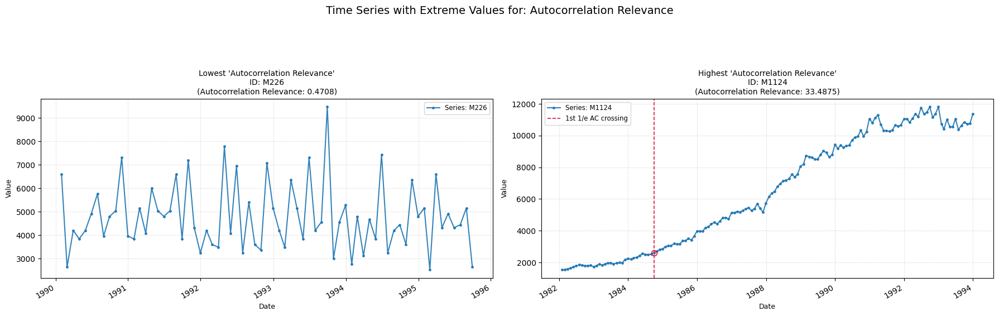

## ac_relevance

Measures the first time lag at which the autocorrelation function drops below 1/e.

**Low value:** Means the series has a more unpredicatble behaviour.  
**High value:** Means the series has a more predictable behaviour.

    

    

**No parameters**

