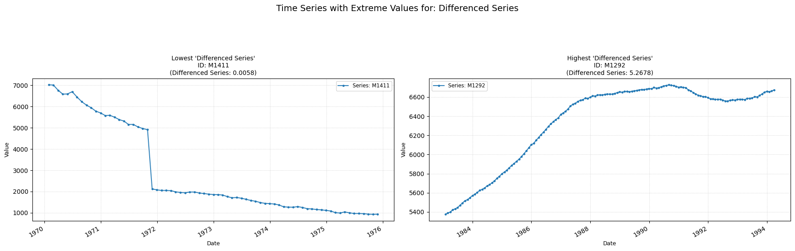

## diff_series

Computes the autocorrelation value of the differenced series.

**Low value:** Means there is no linear relationship between past and current values in the de-trended series.  
**High value:** Means there is a significant linear relationship between past and current values in the de-trended series.

    

    

**No parameters**

