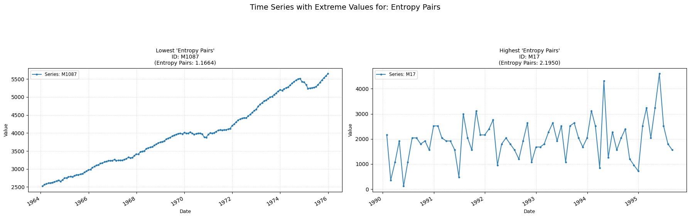

## entropy_pairs

Measures entropy based on the 3 quantile bins of the time-series.  
**Low value:** Means simpler patterns in the time-series sequence.  
**High value:** Means more complex patterns in the time-series sequence.

    

    

**No parameters**

