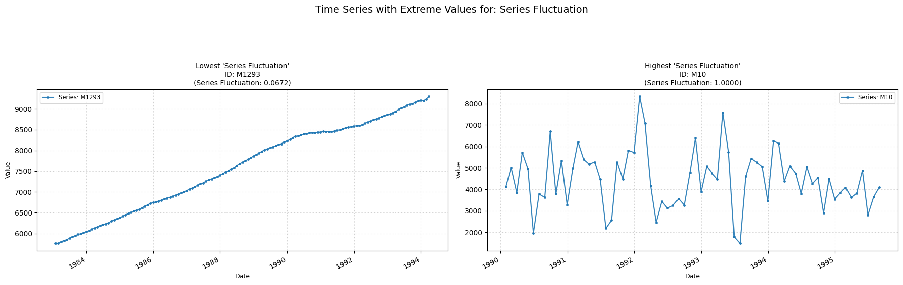

## fluctuation

Measures the proportion of large changes in the time-series.  
**Low value:** Means few/none large fluctuations.  
**High value:** Means many large fluctuations.

    

    

**No parameters**

