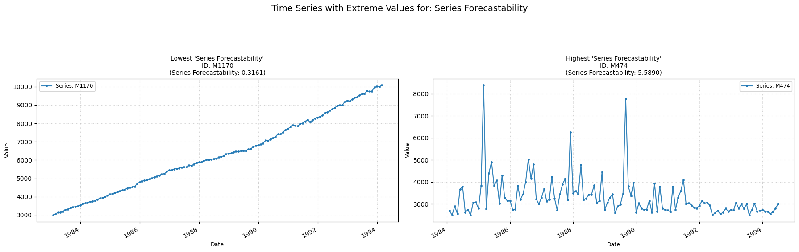

## forecastability

Measures the forecastibility of a time-series.  
**Low value:** Means there are strong signs of a trend across the time-series.  
**High value:** Means the time-series is probably white-noise.

    

    

<h3>Parameters Table</h3>

<table id="T_a6486">
  <thead>
    <tr>
      <th id="T_a6486_level0_col0" class="col_heading level0 col0" >Parameter</th>
      <th id="T_a6486_level0_col1" class="col_heading level0 col1" >Type</th>
      <th id="T_a6486_level0_col2" class="col_heading level0 col2" >Default</th>
      <th id="T_a6486_level0_col3" class="col_heading level0 col3" >Description</th>
    </tr>
  </thead>
  <tbody>
    <tr>
      <td id="T_a6486_row0_col0" class="data row0 col0" >sf</td>
      <td id="T_a6486_row0_col1" class="data row0 col1" >float</td>
      <td id="T_a6486_row0_col2" class="data row0 col2" >Mandatory</td>
      <td id="T_a6486_row0_col3" class="data row0 col3" >Sampling frequency.</td>
    </tr>
    <tr>
      <td id="T_a6486_row1_col0" class="data row1 col0" >method</td>
      <td id="T_a6486_row1_col1" class="data row1 col1" >str</td>
      <td id="T_a6486_row1_col2" class="data row1 col2" >welch</td>
      <td id="T_a6486_row1_col3" class="data row1 col3" >PSD calculation method ('welch' or 'fft').</td>
    </tr>
    <tr>
      <td id="T_a6486_row2_col0" class="data row2 col0" >nperseg</td>
      <td id="T_a6486_row2_col1" class="data row2 col1" >int or None</td>
      <td id="T_a6486_row2_col2" class="data row2 col2" >None</td>
      <td id="T_a6486_row2_col3" class="data row2 col3" >Segment length for welch method. If None, default based on data length</td>
    </tr>
    <tr>
      <td id="T_a6486_row3_col0" class="data row3 col0" >normalize</td>
      <td id="T_a6486_row3_col1" class="data row3 col1" >bool</td>
      <td id="T_a6486_row3_col2" class="data row3 col2" >False</td>
      <td id="T_a6486_row3_col3" class="data row3 col3" >Normalize output to [0, 1]</td>
    </tr>
  </tbody>
</table>

