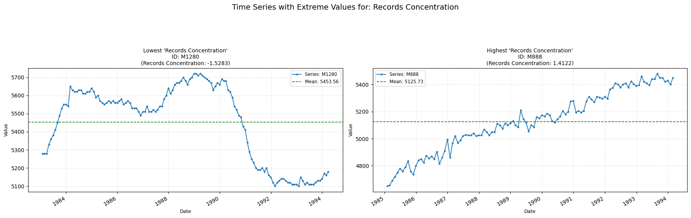

## **rec_concentration**

Computes the relative position of the most probable value in relation to the mean.

**Low value:** Means the most frequent values of the series are concentrated significantly below the mean.  
**High value:** Means the most frequent values of the series are concentrated significantly above the mean.

    

    

##### **No Parameters**

##### **Calculation**

1.	**Data Range:** The minimum and maximum values of the time series are determined.

2.	**Binning:** The calculated range is divided into 10 equal-width bins.

3.	**Histogram:** The number of data points from the time series that fall into each of the 10 bins are counted.

4.	**Mode Identification:** The bin with the highest count (the modal bin) is identified.

5.	**Feature Value:** The returned value is the midpoint (center value) of this modal bin.

##### **Practical Usefulness Examples**

**Customer Segmentation:** While analyzing customer purchase frequency data, this feature might reveal common purchasing patterns (most customers buy 2-3 times a month, for example), helping to segment customers.

**Sensor Data Validation:** If a sensor typically outputs values concentrated in a specific range, a shift in this feature could indicate a calibration issue or a real change in the measured environment.

