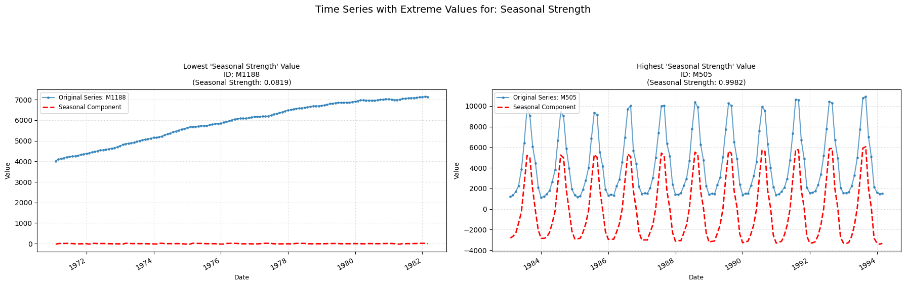

## **seasonal_strength**

Computes the strength of seasonality within the time-series.

**Low value:** A value close to zero means there are few/none indicators of seasonality in the time series.  
**High value:** A value close to one means there are strong signs of seasonality in the time-series.

    

    

##### **Parameters Table**

<table id="T_6f05e">
  <thead>
    <tr>
      <th id="T_6f05e_level0_col0" class="col_heading level0 col0" >Parameter</th>
      <th id="T_6f05e_level0_col1" class="col_heading level0 col1" >Type</th>
      <th id="T_6f05e_level0_col2" class="col_heading level0 col2" >Default</th>
      <th id="T_6f05e_level0_col3" class="col_heading level0 col3" >Description</th>
    </tr>
  </thead>
  <tbody>
    <tr>
      <td id="T_6f05e_row0_col0" class="data row0 col0" >period</td>
      <td id="T_6f05e_row0_col1" class="data row0 col1" >int</td>
      <td id="T_6f05e_row0_col2" class="data row0 col2" >'1'</td>
      <td id="T_6f05e_row0_col3" class="data row0 col3" >Frequency of the time series (e.g. 12 for monthly)</td>
    </tr>
    <tr>
      <td id="T_6f05e_row1_col0" class="data row1 col0" >seasonal</td>
      <td id="T_6f05e_row1_col1" class="data row1 col1" >int</td>
      <td id="T_6f05e_row1_col2" class="data row1 col2" >7</td>
      <td id="T_6f05e_row1_col3" class="data row1 col3" >Length of the seasonal smoother (must be odd).</td>
    </tr>
    <tr>
      <td id="T_6f05e_row2_col0" class="data row2 col0" >robust</td>
      <td id="T_6f05e_row2_col1" class="data row2 col1" >bool</td>
      <td id="T_6f05e_row2_col2" class="data row2 col2" >False</td>
      <td id="T_6f05e_row2_col3" class="data row2 col3" >Flag for robust fitting.</td>
    </tr>
  </tbody>
</table>

##### **Calculation**

1.	**STL Decomposition:** The time series Yt is decomposed into trend (Tt), seasonal (St), and remainder (Rt) components, using an STL decomposition.

2.	**Detrended Series:** The detrended series is calculated as Yt′=Yt−Tt=St+Rt.

3.	**Variances Calculation:**
    - The variance of the remainder component is calculated: Var(Rt).
    - The variance of the detrended series is calculated: Var(Yt′).

4.	**Seasonal Strength Calculation:** The value for seasonal strength is computed as max (0, 1 − Var(Yt′) * Var(Rt)). This value is capped between 0 and 1 and returned.

##### **Practical Usefulness Examples**

**Retail Demand Planning:** A high seasonal strength for ice cream sales (peaking in summer) allows a company to confidently plan production and marketing efforts around these predictable peaks and troughs.

**Tourism Industry:** Hotels can use the seasonal strength of booking data to optimize pricing, staffing and promotions, anticipating high and low seasons.

