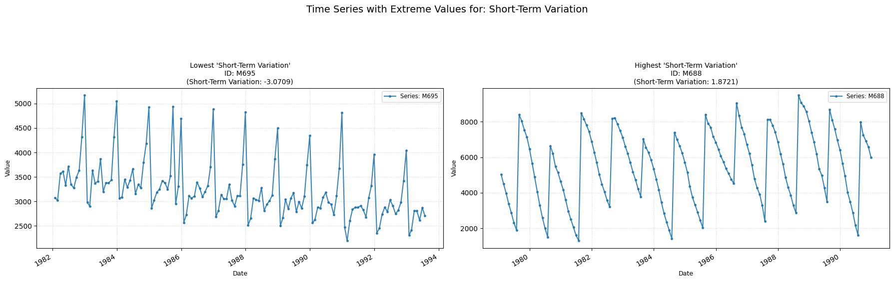

## **st_variation**

Computes the average of the cube of sucessive time-series differences.

**Low value:** Means the average of the short-term variation across the series is low.  
**High value:** Means the average of the short-term variation across the series is high, indicating a frantic behaviour of the data points.

    

    

##### **No Parameters**

##### **Calculation**

1.	**Sucessive Differences:** Iterate through the time series from the second point to the penultimate point (t=1 to N−1), computing a comparison between each Yt point and its previous Yt-1 point.

3.	**Final Counting:** The number of times Yt > Yt−1 is then counted and returned.

##### **Practical Usefulness Examples**

**Quality Control:** In a manufacturing process, if a product dimension shows low short-term variation, it suggests stability. An increase in reversals might indicate an emerging issue.

**Algorithmic Trading:** A high number of local upward movements might suggest short-term momentum that a trading algorithm could try to exploit.
