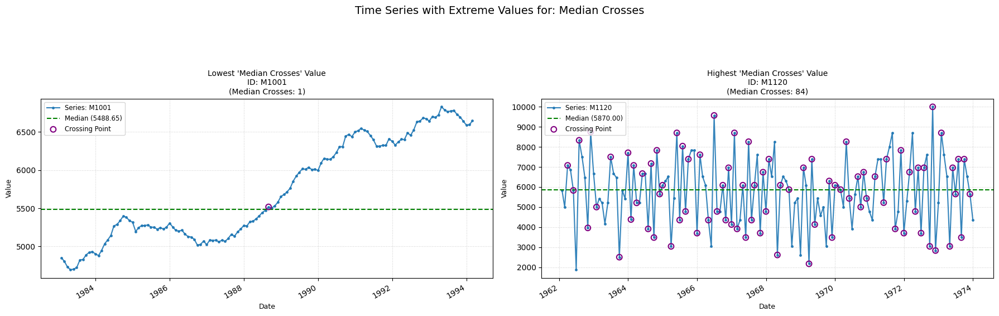

## median_crosses

Counts the number of times a time-series crosses the median line.  
**Low value:** Means there are few/none oscillations across the time-series.  
**High value:** Means there are frequent oscillations across the time-series.

    

    

**No parameters**

