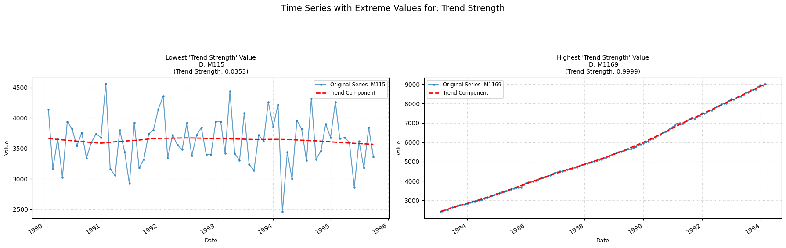

## trend_strength

Computes the strength of a trend within the time-series.  
**Low value:** A value close to zero means there are few/none indicators of a trend in the time series.  
**High value:** A value close to one means there are strong signs of the series containing a trend.

    

    

<h3>Parameters Table</h3>

<table id="T_d2389">
  <thead>
    <tr>
      <th id="T_d2389_level0_col0" class="col_heading level0 col0" >Parameter</th>
      <th id="T_d2389_level0_col1" class="col_heading level0 col1" >Type</th>
      <th id="T_d2389_level0_col2" class="col_heading level0 col2" >Default</th>
      <th id="T_d2389_level0_col3" class="col_heading level0 col3" >Description</th>
    </tr>
  </thead>
  <tbody>
    <tr>
      <td id="T_d2389_row0_col0" class="data row0 col0" >period</td>
      <td id="T_d2389_row0_col1" class="data row0 col1" >int</td>
      <td id="T_d2389_row0_col2" class="data row0 col2" >'1'</td>
      <td id="T_d2389_row0_col3" class="data row0 col3" >Frequency of the time series (e.g. 12 for monthly)</td>
    </tr>
    <tr>
      <td id="T_d2389_row1_col0" class="data row1 col0" >seasonal</td>
      <td id="T_d2389_row1_col1" class="data row1 col1" >int</td>
      <td id="T_d2389_row1_col2" class="data row1 col2" >7</td>
      <td id="T_d2389_row1_col3" class="data row1 col3" >Length of the seasonal smoother (must be odd).</td>
    </tr>
    <tr>
      <td id="T_d2389_row2_col0" class="data row2 col0" >robust</td>
      <td id="T_d2389_row2_col1" class="data row2 col1" >bool</td>
      <td id="T_d2389_row2_col2" class="data row2 col2" >False</td>
      <td id="T_d2389_row2_col3" class="data row2 col3" >Flag for robust fitting.</td>
    </tr>
  </tbody>
</table>

