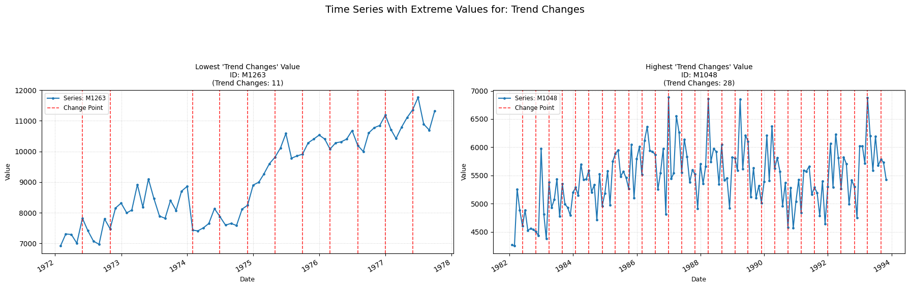

## trend_changes

Detects the number of points where the trend changes.  
**Low value:** The trend has few/none shifting points, and is constant through time.  
**High value:** The trend is constantly shifting, provoking many structural changes.

    

    

<h3>Parameters Table</h3>

<table id="T_4c0ff">
  <thead>
    <tr>
      <th id="T_4c0ff_level0_col0" class="col_heading level0 col0" >Parameter</th>
      <th id="T_4c0ff_level0_col1" class="col_heading level0 col1" >Type</th>
      <th id="T_4c0ff_level0_col2" class="col_heading level0 col2" >Default</th>
      <th id="T_4c0ff_level0_col3" class="col_heading level0 col3" >Description</th>
    </tr>
  </thead>
  <tbody>
    <tr>
      <td id="T_4c0ff_row0_col0" class="data row0 col0" >model</td>
      <td id="T_4c0ff_row0_col1" class="data row0 col1" >str</td>
      <td id="T_4c0ff_row0_col2" class="data row0 col2" >'l2'</td>
      <td id="T_4c0ff_row0_col3" class="data row0 col3" >Cost function model (e.g., 'l1', 'l2', 'rbf')</td>
    </tr>
    <tr>
      <td id="T_4c0ff_row1_col0" class="data row1 col0" >min_size</td>
      <td id="T_4c0ff_row1_col1" class="data row1 col1" >int</td>
      <td id="T_4c0ff_row1_col2" class="data row1 col2" >2</td>
      <td id="T_4c0ff_row1_col3" class="data row1 col3" >Minimum number of samples in a segment.</td>
    </tr>
    <tr>
      <td id="T_4c0ff_row2_col0" class="data row2 col0" >jump</td>
      <td id="T_4c0ff_row2_col1" class="data row2 col1" >int</td>
      <td id="T_4c0ff_row2_col2" class="data row2 col2" >5</td>
      <td id="T_4c0ff_row2_col3" class="data row2 col3" >Subsample window for considering change points.</td>
    </tr>
    <tr>
      <td id="T_4c0ff_row3_col0" class="data row3 col0" >params</td>
      <td id="T_4c0ff_row3_col1" class="data row3 col1" >dict or None</td>
      <td id="T_4c0ff_row3_col2" class="data row3 col2" >None</td>
      <td id="T_4c0ff_row3_col3" class="data row3 col3" >Additional parameters dictionary for the cost 'model'.</td>
    </tr>
    <tr>
      <td id="T_4c0ff_row4_col0" class="data row4 col0" >custom_cost</td>
      <td id="T_4c0ff_row4_col1" class="data row4 col1" >BaseCost or None</td>
      <td id="T_4c0ff_row4_col2" class="data row4 col2" >None</td>
      <td id="T_4c0ff_row4_col3" class="data row4 col3" >Custom cost function (overrides 'model').</td>
    </tr>
  </tbody>
</table>

