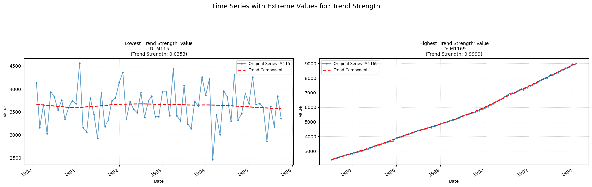

## **trend_strength**

Computes the strength of a trend within the time-series.  
**Low value:** A value close to zero means there are few/none indicators of a trend in the time series.  
**High value:** A value close to one means there are strong signs of the series containing a trend.

    

    

##### **Parameters Table**

<table id="T_2b518">
  <thead>
    <tr>
      <th id="T_2b518_level0_col0" class="col_heading level0 col0" >Parameter</th>
      <th id="T_2b518_level0_col1" class="col_heading level0 col1" >Type</th>
      <th id="T_2b518_level0_col2" class="col_heading level0 col2" >Default</th>
      <th id="T_2b518_level0_col3" class="col_heading level0 col3" >Description</th>
    </tr>
  </thead>
  <tbody>
    <tr>
      <td id="T_2b518_row0_col0" class="data row0 col0" >period</td>
      <td id="T_2b518_row0_col1" class="data row0 col1" >int</td>
      <td id="T_2b518_row0_col2" class="data row0 col2" >'1'</td>
      <td id="T_2b518_row0_col3" class="data row0 col3" >Frequency of the time series (e.g. 12 for monthly)</td>
    </tr>
    <tr>
      <td id="T_2b518_row1_col0" class="data row1 col0" >seasonal</td>
      <td id="T_2b518_row1_col1" class="data row1 col1" >int</td>
      <td id="T_2b518_row1_col2" class="data row1 col2" >7</td>
      <td id="T_2b518_row1_col3" class="data row1 col3" >Length of the seasonal smoother (must be odd).</td>
    </tr>
    <tr>
      <td id="T_2b518_row2_col0" class="data row2 col0" >robust</td>
      <td id="T_2b518_row2_col1" class="data row2 col1" >bool</td>
      <td id="T_2b518_row2_col2" class="data row2 col2" >False</td>
      <td id="T_2b518_row2_col3" class="data row2 col3" >Flag for robust fitting.</td>
    </tr>
  </tbody>
</table>

##### **Calculation**

1.  **STL Decomposition:** The time series (Yt) is decomposed into trend (Tt), seasonal (St), and remainder (Rt) components, such that Yt=Tt+St+Rt (for additive decomposition). This is done iteratively:

    - An initial trend is estimated (using a moving average).

    - The series is detrended (Yt−Tt).

    - The seasonal component is estimated by averaging the detrended series over each seasonal period and then smoothing these seasonal sub-series (using Loess).

    - The seasonal component is removed from the original series to get a seasonally adjusted series (Yt−St).

    - A new trend component Tt is estimated by smoothing the seasonally adjusted series (using Loess).

    - These steps are repeated a few times for robustness.

2.	**Deseasonalized Series:** The deseasonalized series is calculated as Dt=Yt−St=Tt+Rt.

3.	**Variances:**

    - The variance of the remainder component is calculated: Var(Rt).

    - The variance of the deseasonalized series is calculated: Var(Dt).

4.	**Strength Calculation:** Trend strength is computed as: strength=max(0,1−Var(Dt)Var(Rt)). The result is capped between 0 and 1 and returned.

##### **Practical Usefulness Examples**

**Retail Sales**: A business analyst can use trend strength to assess if an observed increase in monthly sales is a statistically significant upward movement or just part of normal random fluctuations. A strong trend might justify increased inventory orders, while a weak trend might suggest caution.

**Stock Market Analysis**: An investor could use trend strength to determine if a stock price is in a strong, reliable uptrend or downtrend, influencing buy/sell decisions, rather than reacting to short-term volatility.

