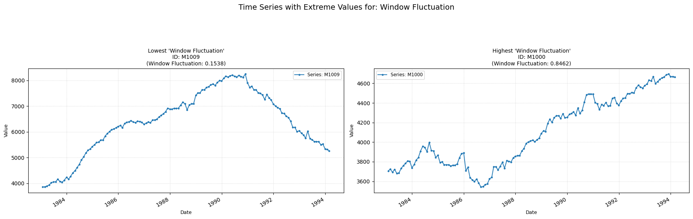

## **window_fluctuation**

Measures the proportion of large changes over short time-windows.

**Low value:** Means the fluctuation of the time-series is more structured and shows few signs of randomness.  
**High value:** Means the fluctuation of the time-series shows signs of randomness.

    

    

##### **No Parameters**

##### **Calculation**

1.	**Defining Window Sizes:** Approximately 50 window sizes are generated, logarithmically spaced from a minimum defined size up to half the series length. Duplicates are removed and if fewer than 12 unique τ values remain, the feature returns 0.

2.	**Cumulative Sum:** The series is then transformed into its cumulative sum.

3.	**Fluctuation Calculation (for each Window Size):** For each unique window size the cumulative sum series is divided into non-overlapping segments of length τ. For each segment:
    - A linear trend is fitted to the segment data points and then is subtracted to get a detrended segment.
    - For the "rsrangefit" method: The squared range of this detrended segment is calculated.
    - For the "dfa" method: The sum of squares of the values in the detrended segment is calculated.
The values for all segments are then aggregated.

4.	**Log-Log Analysis and Breakpoint Detection:** The logarithms of the window sizes and their corresponding fluctuation values are computed using an algorithm that searches for an optimal breakpoint. This is done by iterating through possible split points. For each split point i:
    - Fit a linear regression to the first i points.
    - Fit another linear regression to the remaining points.
    - Calculate the sum of squared errors (residuals) for both fits. The total sum of squared errors for this split point i is stored.
The split point i that yields the minimum total sum of squared errors is chosen as the optimal breakpoint. A minimum number of points is required for each regression.

5.	**Final Computation:** The final computed and returned value is the proportion of window sizes that fall into the first linear segment (before the optimal breakpoint).

##### **Practical Usefulness Examples**

**Financial Time Series:** Can help distinguish between periods of persistent trending (Hurst exponent > 0.5) and anti-persistent, mean-reverting behavior (Hurst < 0.5) in asset prices, informing trading strategies.

**Geophysical Data Analysis:** In analyzing earthquake data or river flow levels, this feature can characterize the long-range dependence or memory effects, helping to understand the underlying physical processes.

