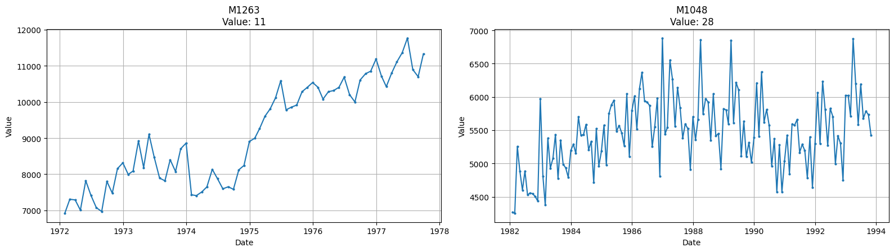
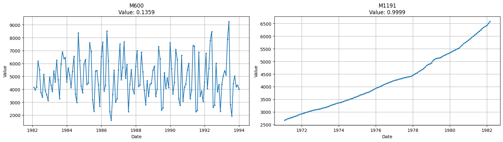
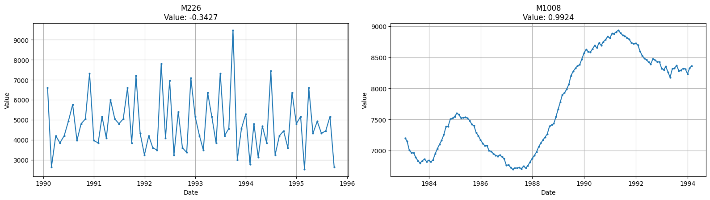
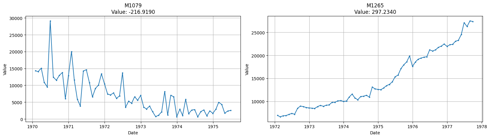
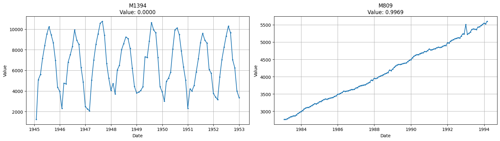

## Pelt_Num_Breakpoints

This feature detects the number of points where the trend changes. A low value means the trend has few/none shifting points, and is constant through time, while a high value means the trend is constantly shifting, provoking many estrutural changes.

    

    

## STL_Trend_Strength

This feature computes the strenght of a trend within the time-series. A low value (close to zero) means there are few/none indicators of a trend in the time series while a high value (close to one) means there are strong signs of the series containing a trend.

    

    

## ACF_FirstLag

This feature measures the first 1/e crossing of the auto-correlation function, which means a low/negative value indicates negative auto-correlation while a high/positive value indicates strong auto-correlation.

    

    

## LinearRegression_Slope

This feature measures the overall linear trend. A low/negative value means there is a strong downward trend while a high/positive value means a strong upward trend.

    

    

## LinearRegression_R2

This feature measures the linear fit of a time-series. A low value (close to zero) means few/none linear fit while a high value (close to one) means a high linear fit.

    

    

