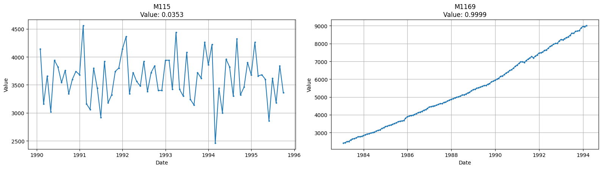
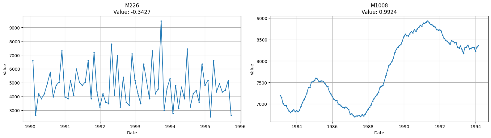
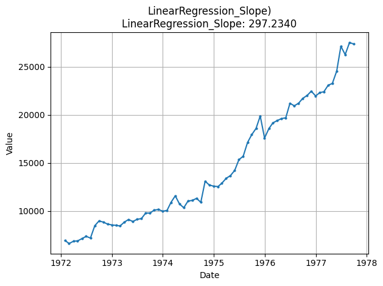

## Pelt_Num_Breakpoints

This feature detects the number of points where the trend changes.  
**Low value:** The trend has few/none shifting points, and is constant through time.  
**High value:** The trend is constantly shifting, provoking many structural changes.

    

    

<table>
<thead>
<tr><th>Parameter  </th><th>Type            </th><th>Description                                           </th><th>Default  </th></tr>
</thead>
<tbody>
<tr><td>model      </td><td>str             </td><td>Cost function model (e.g., &quot;l1&quot;, &quot;l2&quot;, &quot;rbf&quot;)         </td><td>&quot;l2&quot;     </td></tr>
<tr><td>custom_cost</td><td>BaseCost or None</td><td>Custom cost function object. Overrides `model`.       </td><td>None     </td></tr>
<tr><td>min_size   </td><td>int             </td><td>Minimum allowable segment length.                     </td><td>2        </td></tr>
<tr><td>jump       </td><td>int             </td><td>Subsampling step size for checking breakpoints.       </td><td>5        </td></tr>
<tr><td>params     </td><td>dict or None    </td><td>Additional parameters dictionary for the cost `model`.</td><td>None     </td></tr>
</tbody>
</table>

## STL_Trend_Strength

This feature computes the strength of a trend within the time-series.  
**Low value:** A value close to zero means there are few/none indicators of a trend in the time series.  
**High value:** A value close to one means there are strong signs of the series containing a trend.

    

    

<table>
<thead>
<tr><th>Parameter  </th><th>Type  </th><th>Description                                                  </th><th style="text-align: right;">  Default</th></tr>
</thead>
<tbody>
<tr><td>freq       </td><td>int   </td><td>Frequency (period) of the time series (e.g., 12 for monthly).</td><td style="text-align: right;">        1</td></tr>
<tr><td>seasonal   </td><td>int   </td><td>Length of the seasonal smoother (must be odd).               </td><td style="text-align: right;">        7</td></tr>
<tr><td>robust     </td><td>bool  </td><td>Flag for robust fitting.                                     </td><td style="text-align: right;">    False</td></tr>
</tbody>
</table>

## ACF_FirstLag

This feature measures the first autocorrelation coefficient (lag 1).  
**Low value:** A negative value indicates negative autocorrelation (tendency to oscillate).  
**High value:** A positive value indicates positive autocorrelation (tendency to persist).

    

    

<table>
<thead>
<tr><th>Parameter  </th><th>Type  </th><th>Description                        </th><th style="text-align: right;">  Default</th></tr>
</thead>
<tbody>
<tr><td>nlags      </td><td>int   </td><td>Number of lags for ACF calculation.</td><td style="text-align: right;">       10</td></tr>
</tbody>
</table>

## LinearRegression_Slope

This feature measures the overall linear trend slope.  
**Low value:** A negative value means there is a downward trend.  
**High value:** A positive value means an upward trend.

    

    

**No Parameters**

## LinearRegression_R2

This feature measures how well a linear trend fits the time-series (Coefficient of Determination, $R^2$).  
**Low value:** A value close to zero means a linear model explains little variance.  
**High value:** A value close to one means a linear model explains much of the variance.

    

    

**No Parameters**

